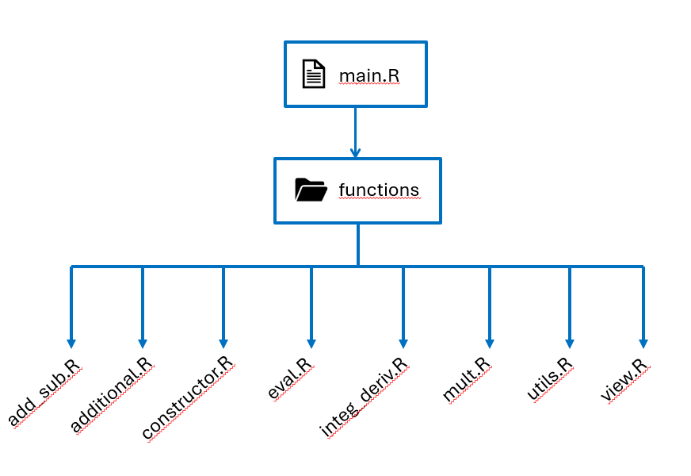

# Structure du dossier R

**Menu principal : [revenir à l'accueil](/readme.md)**

---

> Il permet d'appeller tous les fichiers contenus dans le dossier functions, cette action a pour but d'importer le projet

> Les fichiers des fonctions sont classés selon l'ordre du cours

> L'objectif était de pouvoir naviguer sur le projet plus facilement

