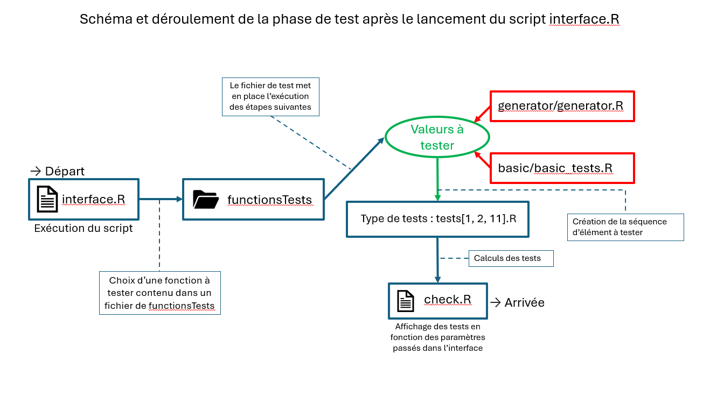

# Structure du dossier Tests

**Menu principal : [revenir à l'accueil](/readme.md)**

>## Organisation du dossier Tests :

>**interface.R :** permet de demander le test d’une fonction

>_On distingue 3 types de tests (dans le dossier « types ») :_
>- **Test1**, qui correspond à une fonction ayant pour variable un polynôme
>- **Test2**, pour une fonction ayant pour variables deux polynômes
>- **Test11**, pour une fonction ayant pour paramètres un polynôme et une valeur numérique quelconque.

>**test_[une fonction].R** (du dossier *functionsTests*) : met en relation plusieurs fichiers afin de tester la fonction du 
projet. Cela est possible grâce à la bibliothèque polynom, et certaines fonctions natives 
de R.

>**check.R :** affichage des tests pour 1 ou 2 variables

>**generator.R :** génère une liste de polynôme ou de valeur

>**basic.R :** permet d’ajouter des tests obligatoires

