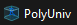

# Introduction : *Naviguer dans le projet*

**Menu principal : [revenir à l'accueil](/readme.md)**

---

## Dossiers

Le projet est composé de 3 parties (dossiers):
- R : il s'agit de l'ensemble des fonctions du projet
- Tests : contient toute la structure de tests des fonctions du dossier R
- docs : est composé essentiellement des fichiers de documentations (dont celui ci)

## Installation du projet

>Pour que le projet fonctionne, il faut ouvrir le projet *PolyUniv* situé dans le même répertoire que le fichier readme.md 

## Guides d'utilisations :
Pour naviguer à travers les docs, vous pouvez :

-> consulter le fonctionnement du fichier main.R : [Utilisation : *Utiliser les fonctions du projet*](./main.md)

-> consulter le fonctionnement des tests pour le fichier interface.R : [Utilisation : *Utiliser les fonctions du projet*](./tests.md)